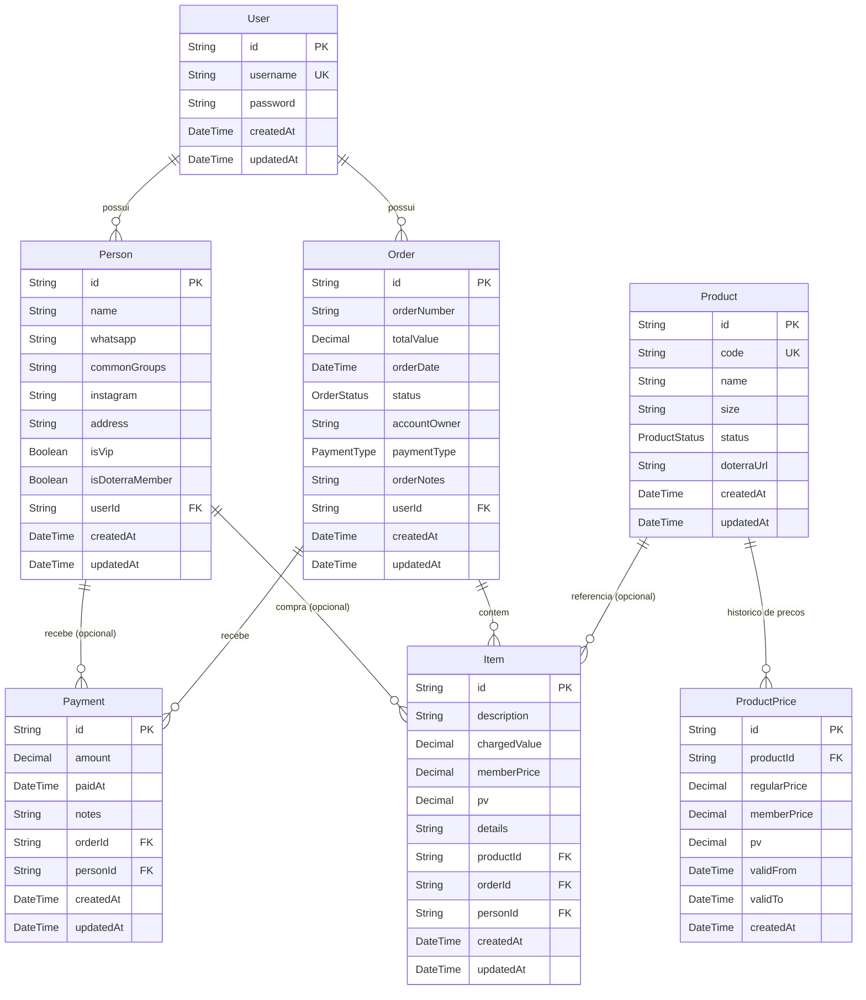

# Modelo de Dados

Diagrama do modelo de dados da aplicação (PostgreSQL via Prisma), com isolamento por usuário e relacionamentos financeiros.

## Enums

### `OrderStatus`

| Valor      | Significado                                     |
| ---------- | ----------------------------------------------- |
| `PENDENTE` | Pedido sem nenhum pagamento registrado.         |
| `PARCIAL`  | Pedido com pagamento(s) cobrindo parte do total.|
| `QUITADO`  | Pedido totalmente pago.                         |

### `PaymentType`

| Valor            | Significado                      |
| ---------------- | -------------------------------- |
| `PIX`            | Pagamento via Pix.               |
| `BOLETO`         | Pagamento via boleto.            |
| `CARTAO_CREDITO` | Pagamento via cartão de crédito. |

### `ProductStatus`

| Valor           | Significado                     |
| --------------- | ------------------------------- |
| `ATIVO`         | Produto disponível no catálogo. |
| `INDISPONIVEL`  | Produto temporariamente fora.   |
| `INATIVO`       | Produto desativado.             |

## Relacionamentos e regras

- **Isolamento**: `User` é a raiz do isolamento. `Person` e `Order` pertencem a um `User` (`onDelete: Cascade`). `Item` e `Payment` herdam o escopo indiretamente via `Order`.
- **Transição de status**: `Order.status` segue `PENDENTE` → `PARCIAL` → `QUITADO` conforme pagamentos são registrados.
- **Monetário**: todos os valores financeiros (`totalValue`, `chargedValue`, `memberPrice`, `pv`, `amount`, `regularPrice`) são `Decimal(10,2)` e manipulados em centavos inteiros na camada de aplicação.
- **Optionalidade**: `Item.productId` e `Item.personId` são opcionais (`onDelete: SetNull`); `Payment.personId` também é opcional.
- **Produtos**: `ProductPrice` mantém histórico temporal de preços (`validFrom`/`validTo`), permitindo auditar preços antigos sem alterar itens já registrados.
- **Enums**: `Order.status` usa `OrderStatus`; `Product.status` usa `ProductStatus`; `Order.paymentType` aceita `PaymentType` (opcional).
